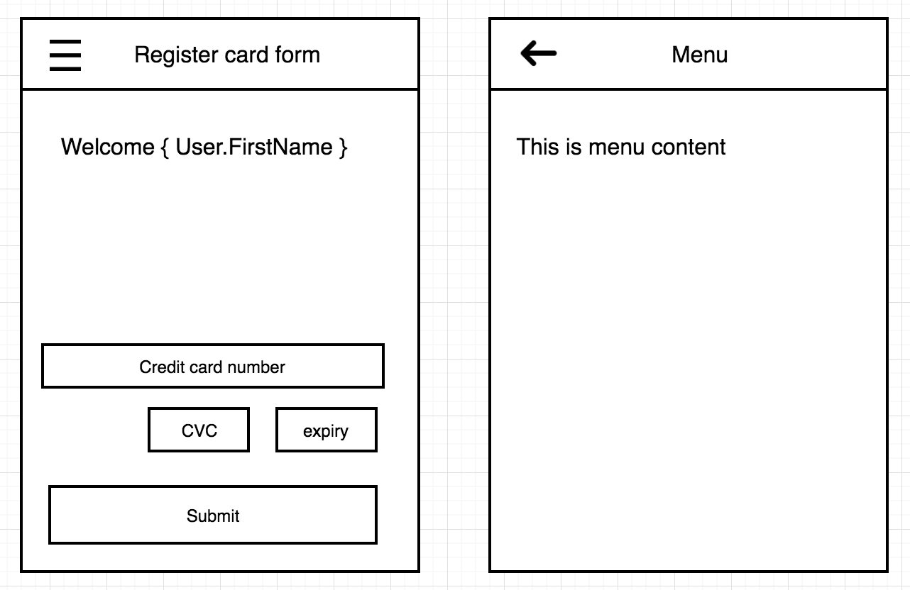

Create a one page application following the LO-FIs given in this assignment.

We suggest to use create-react-app typescript for your setup.

# LO-FI

Remember these are LO-FI and should only be treated as such.

# Spec

These are the only functional requirements for your implementation:

## Navigation

- Click on burger icon shows menu
- Click on back shows register card form

## Inputs

- Credit card field is any number
- CVC is any number
- Expires is any valid date

## Submit

- You cannot submit until input fields
- When submitting then console log the input values

# What is valued

- Tests
- Clean Code
- State Management
- Design (Responsive)

# Tech

You need to use at least these:

- React
- Typescript
